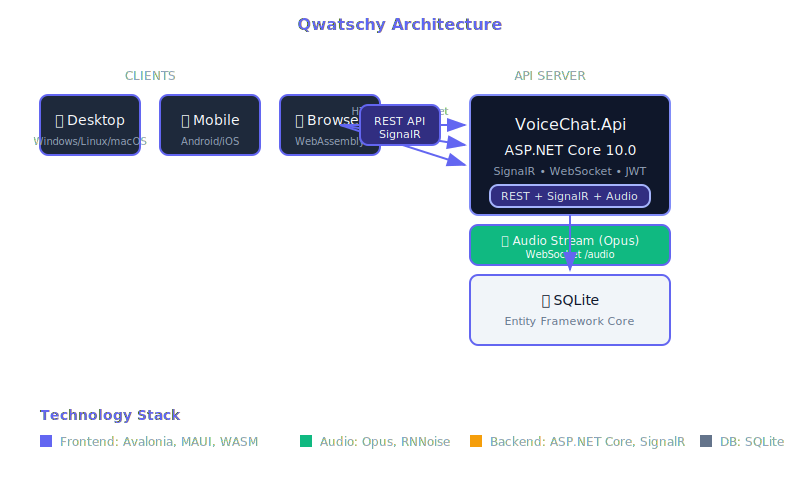

# Architektur

## Überblick

Qwatschy ist eine moderne, plattformübergreifende Anwendung mit einer Client-Server-Architektur.



## Technologie-Stack

### Backend

| Komponente | Technologie |
|------------|-------------|
| Framework | ASP.NET Core 10.0 |
| Echtzeit | SignalR |
| Audio | WebSocket + Opus (Concentus) |
| Authentifizierung | JWT Bearer Tokens |
| Datenbank | Entity Framework Core + SQLite |

### Frontend

| Komponente | Technologie |
|------------|-------------|
| Desktop | Avalonia 11.x |
| Mobile | .NET MAUI |
| Browser | WebAssembly |
| MVVM | CommunityToolkit.Mvvm |
| Audio | ManagedBass, RNNoise |

## API-Endpunkte

### REST API

| Methode | Pfad | Beschreibung |
|---------|------|-------------|
| `POST` | `/api/Login` | Anmelden und JWT erhalten |
| `POST` | `/api/validate` | JWT validieren |
| `POST` | `/api/GetChannels` | Alle Channels abrufen |

### SignalR Hub (`/connection`)

| Methode | Beschreibung |
|---------|-------------|
| `JoinChannel(channelId)` | Channel beitreten |
| `AddChannel(name)` | Channel erstellen |
| `DeleteChannel(channelId)` | Channel löschen |
| `SendMessage(message)` | Nachricht senden |
| `GetMessages(channelId, skip, take)` | Nachrichten laden |

### WebSocket Audio (`/audio`)

Binäres Audio-Streaming mit Opus-kodierten Daten.

## Projektstruktur

```
VoiceChat.slnx
├── VoiceChat.Api/           # Web API
├── VoiceChat.Data/          # Datenbank-Zugriff
├── VoiceChat.Entities/      # Domänen-Entitäten
├── VoiceChat.Shared/       # Geteilte DTOs
└── VoiceChat.Client/       # UI-Anwendungen
    ├── VoiceChat.Client/         # Geteilter UI-Code
    ├── VoiceChat.Client.Desktop/ # Desktop
    ├── VoiceChat.Client.Browser/ # Web (WASM)
    ├── VoiceChat.Client.Android/ # Android
    └── VoiceChat.Client.iOS/     # iOS
```

## Sicherheit

- **Authentifizierung**: JWT-Token mit Ablaufzeit
- **Validierung**: Serverseitige Eingabevalidierung
- **SQL Injection**: Geschützt durch EF Core

## CI/CD Pipeline

### Build & Release Pipeline

Die automatisierte Build-Pipeline wird bei jedem Push auf den `master`-Branch ausgeführt:

| Job | Beschreibung | Ausgaben |
|-----|--------------|----------|
| `build-client` | Client für Windows & Linux erstellen | Velopack-Pakete (.nupkg, AppImage, Setup.exe) |
| `build-deb` | Debian-Paket erstellen | .deb-Datei |
| `build-flatpak` | Flatpak-Paket erstellen | .flatpak-Datei |
| `build-server` | Server für Windows & Linux erstellen | ZIP-Archive |
| `release` | GitHub Release erstellen | Getaggte Version mit allen Artefakten |

**Versionierung**: Basisversion aus `VERSION`-Datei + GitHub Run Number (z.B. `1.0.0.123`)

### Dokumentations-Pipeline

Die Dokumentation wird automatisch auf GitHub Pages deployed wenn:
- Dateien im `docs/`-Verzeichnis geändert werden
- Die Workflow-Datei selbst geändert wird
- Manuelle Auslösung via `workflow_dispatch`

### Workflow-Dateien

| Datei | Zweck |
|-------|-------|
| `.github/workflows/main.yml` | Build & Release |
| `.github/workflows/deploy-docs.yml` | Dokumentations-Deployment |
