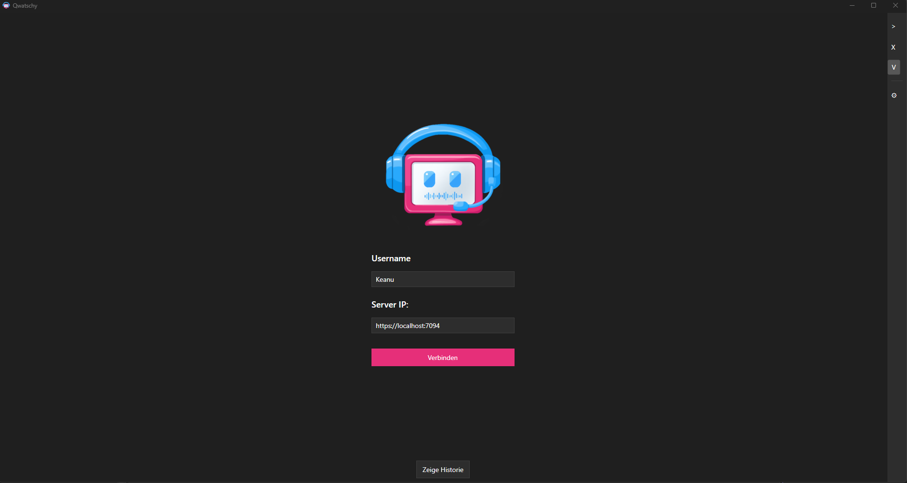
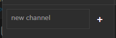

# Erste Schritte

## Server aufsetzen

### Voraussetzungen
- .NET 10.0 SDK installiert
- Port 5000 und 5001 verfügbar

### Server starten
```bash
cd VoiceChat.Api
dotnet run
```

Der Server startet standardmäßig auf `http://localhost:5000`.

### Server-Konfiguration

Die API-Konfiguration findest du in `VoiceChat.Api/appsettings.json`:

```json
{
  "Urls": "http://0.0.0.0:5000",
  "Jwt": {
    "Key": "DEIN_GEHEIMER_SCHLÜSSEL",
    "Issuer": "VoiceChat",
    "Audience": "VoiceChat"
  }
}
```

## Mit dem Server verbinden

### Client starten
1. Starte Qwatschy auf deinem Gerät
2. Du siehst den Anmeldebildschirm



### Anmelden
1. Gib einen **Benutzernamen** ein (z.B. "Max")
2. Gib die **Server-Adresse** ein:
   - Lokal: `http://localhost:5000`
   - Im Netzwerk: `http://192.168.x.x:5000`
   - Online: `https://dein-server.com`
3. Klicke auf **Verbinden**

### Verbindung speichern
Deine letzten Verbindungen werden automatisch gespeichert und können über das Dropdown-Menü schnell wiederhergestellt werden.

## Ersten Channel erstellen

1. Klicke auf das **+** Symbol in der Channel-Leiste
2. Gib einen Namen für den Channel ein (z.B. "Allgemein")
3. Klicke auf **Erstellen**



## Benutzer verwalten

### Online-Benutzer anzeigen
Die Online-Benutzer werden in der linken Leiste unter dem Channel angezeigt.

### Benutzer kicken/bannen
Rechtsklick auf einen Benutzer → Kicken oder Bannen

---

[← Zurück: Installation](./installation) | [Weiter: Funktionen →](./features)
