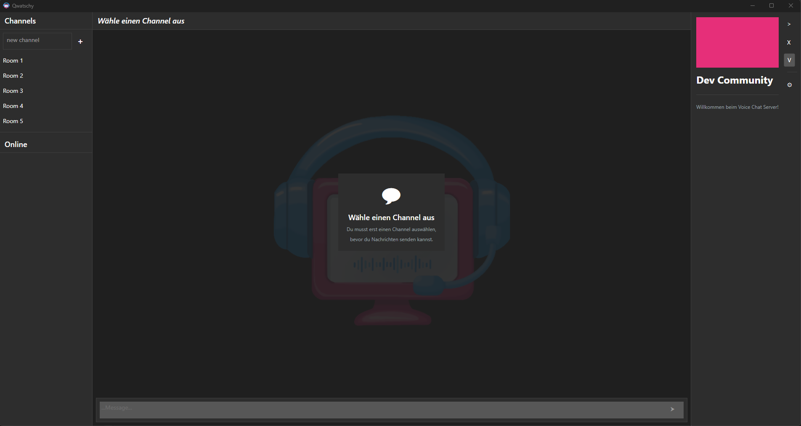
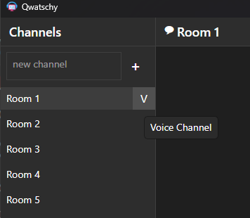

# Features

## Login & Authentication

- **Username**: Choose a unique name
- **Server Address**: IP or domain of the server
- **Connection History**: Recently used servers are saved
- **JWT Authentication**: Secure login with tokens

## Channel Management

### Create Channels
1. Click the **+** button
2. Enter a channel name
3. Confirm with Enter or click "Create"

### Join Channels
- Click on a channel in the list
- The channel opens automatically

### Delete Channels
- Right-click on channel → "Delete"
- Only the creator can delete channels

## Text Chat

### Send Messages
1. Select a channel
2. Type your message in the text field at the bottom
3. Press **Enter** to send

### Load Messages
- For long conversations: Click "Load more..." at the top
- Messages are loaded page by page

### Unread Messages
- Channels with new messages show a **counter**
- The counter appears on the left side of the channel name

## Voice Chat

### Join Voice Chat
1. Click the **Voice button** (🎤) of a channel
2. Wait for the connection to establish
3. Your microphone is now active

### Audio Settings
- **Mute**: Press **M** or click the microphone icon
- **Toggle sound**: Click the speaker button

### Audio Technology
- **Opus Codec**: High-quality audio encoding
- **WebSocket**: Real-time audio streaming
- **Noise Suppression**: RNNoise for clear sound

## User Management

### View Online Users
- List of currently connected users in the channel
- Current user is highlighted

### User Actions (Right-click)
- **Kick**: Temporarily remove from channel
- **Ban**: Permanently exclude from channel

## Design & Themes

### Light Mode
- Light color scheme with blue/teal accents
- Default view

### Dark Mode
- Dark color scheme with pink accents (#e62f79)
- Easy on the eyes at night

## Keyboard Shortcuts

| Key | Action |
|-----|--------|
| **Enter** | Send message |
| **M** | Mute microphone |
| **Escape** | Cancel / Close |

---

[← Back: Getting Started](./getting-started) | [Next: Architecture →](./architecture)
