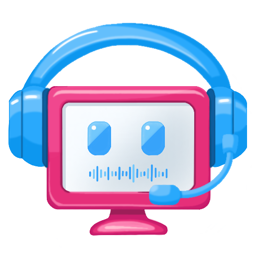

## Willkommen / Welcome

**Qwatschy** ist eine plattformübergreifende Voice-Chat-Anwendung mit Echtzeit-Audio und Text-Chat.

**Qwatschy** is a cross-platform voice chat application with real-time audio and text chat.

  
  <h1>Qwatschy</h1>
  
Modern. Cross-platform. Real-time voice and text chat built with .NET and Avalonia.

  

    <a href="./en/installation.html" class="quick-link">📦 Installation</a>
    <a href="./en/getting-started.html" class="quick-link">🚀 Getting Started</a>
    <a href="./en/features.html" class="quick-link">✨ Features</a>
  

## Sprachauswahl / Language

  <a href="./de/" class="lang-card">
    🇩🇪
    <h3>Deutsch</h3>
    
Deutsche Dokumentation

  </a>
  <a href="./en/" class="lang-card">
    🇬🇧
    <h3>English</h3>
    
English documentation

  </a>

## Quick Links

  <a href="./en/installation.html" class="card">
    
📦

    <h4>Installation</h4>
    
Download and install Qwatschy on Windows, macOS, Android, or use the web version.

  </a>
  <a href="./en/getting-started.html" class="card">
    
🚀

    <h4>Getting Started</h4>
    
Connect to a server and start chatting with friends.

  </a>
  <a href="./en/features.html" class="card">
    
✨

    <h4>Features</h4>
    
Real-time voice chat, text messaging, channel management, and more.

  </a>
  <a href="./en/architecture.html" class="card">
    
🏗️

    <h4>Architecture</h4>
    
Learn about the technology stack and system design.

  </a>

